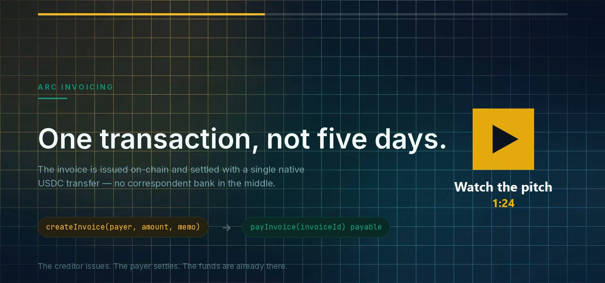
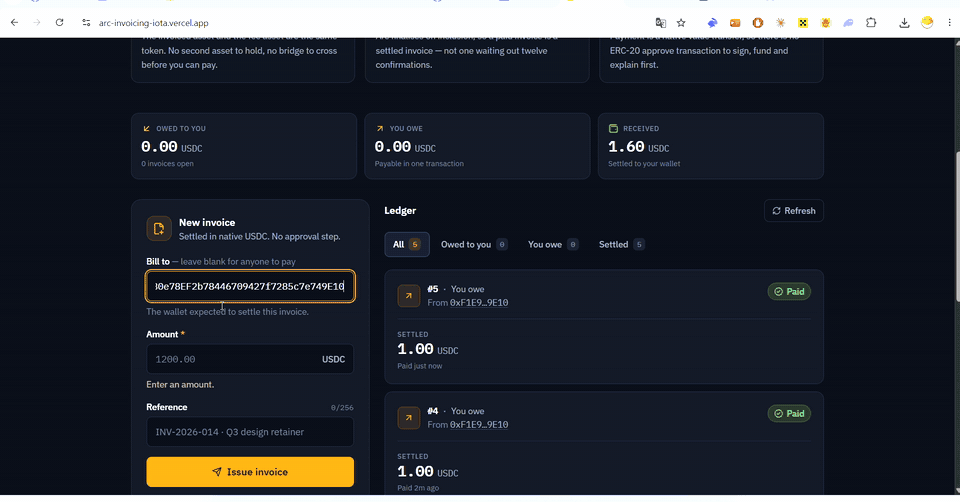

# Arc Invoicing

**Cross-border invoices, issued on-chain and settled with a single native USDC transfer.**

A freelancer in Lisbon bills a client in Singapore. Today that invoice takes two to five
days, passes through correspondent banks, loses 3–6% to FX spread and wire fees, and
neither side can see where the money is while it is in flight.

The same shape holds for an agency billing a retainer, a SaaS company invoicing a
business customer, or a small exporter waiting on a wire — anyone who sends an invoice
across a border and then waits, without being large enough to negotiate better terms
from a bank.

On Arc it is one transaction. The creditor issues the invoice, the payer settles it, and
the money is in the creditor's wallet before the page finishes re-rendering.

| | |
|---|---|
| **Contract** | `ArcInvoicing.sol` — 5.8 KB, no dependencies, no proxy, no owner |
| **Network** | Arc mainnet, chain ID `5042` |
| **Live app** | [https://arc-invoicing-iota.vercel.app](https://arc-invoicing-iota.vercel.app) |
| **Deployed at** | [`0x4AC461f079E9dd4f49f4d8254e4e0cA79b2102BA`](https://explorer.arc.io/address/0x4AC461f079E9dd4f49f4d8254e4e0cA79b2102BA) |

[](https://youtu.be/71x6kP8m4TE)

*The 84-second pitch: the problem, why it only works on Arc, the live demo on
mainnet, and what backs the claims. The shorter loop below is the demo on its own.*



*Recorded live on Arc mainnet: wallet A issues the invoice, wallet B pays it — one
signature, no `approve` before it — and the badge flips to Paid. Invoice #6 on the
[contract](https://explorer.arc.io/address/0x4AC461f079E9dd4f49f4d8254e4e0cA79b2102BA).
The wallet switch is fast-forwarded and blurred.*

---

## Why Arc specifically

This is not a generic EVM app that happens to be deployed on Arc. Three of Arc's
properties change the design of the contract itself.

### 1. USDC is the native gas token, so payment needs no approval

On Ethereum, paying a USDC invoice through a contract is two transactions: `approve`,
then `transferFrom`. That is two wallet confirmations, two fees, and a well-known
failure mode where a user approves and then never completes the payment.

On Arc, USDC **is** the native asset. `payInvoice` is simply `payable`:

```solidity
function payInvoice(uint256 invoiceId) external payable nonReentrant {
    ...
    if (msg.value != amount) revert IncorrectPaymentAmount(amount, msg.value);
```

One signature. No allowance to set, no allowance left dangling, no ERC-20 transfer that
can silently return `false`. The payer also never needs a second asset: on every other
chain they must hold ETH *and* USDC, and an invoice they have the money for can still be
unpayable because they lack gas. Here the money and the gas are the same balance.

### 2. Finality on inclusion, so "Paid" means paid

Arc finalises on inclusion rather than probabilistically over subsequent blocks. That is
why this contract forwards the payment to the creditor inside `payInvoice` instead of
holding it in escrow for a withdrawal step. An invoice that reads `Paid` is an invoice
whose funds have already moved. On a chain with probabilistic finality, showing "Paid"
immediately would be lying to the creditor for the next several minutes.

### 3. One balance, two decimal interfaces

Arc exposes the same USDC balance natively at **18 decimals** and through the ERC-20 at
`0x3600…0000` at **6 decimals**. The contract and the front-end work exclusively in native
18-decimal units, and this is stated at every boundary, because mixing the two is an
error of a factor of 10¹². The ERC-20 address is kept as a public constant for explorers
and integrators, and is deliberately never called.

A useful consequence documented in Arc's own EVM notes: an ERC-20 `balanceOf` of zero
does **not** mean the native balance is zero, because the 6-decimal view truncates.

---

## What the contract does

```
createInvoice(payer, amount, memo) -> invoiceId    issue an invoice; caller is the creditor
payInvoice(invoiceId) payable                      settle it in one native USDC transfer
cancelInvoice(invoiceId)                           creditor voids an unpaid invoice
getInvoice(invoiceId) -> Invoice                   full record and status
getInvoices(ids[]) -> Invoice[]                    batch read, capped at MAX_BATCH (200)
invoicesIssuedByPaged / invoicesBilledToPaged      paged enumeration; what the UI uses
invoicesIssuedByCount / invoicesBilledToCount      index sizes, for paging
invoicesIssuedBy(addr) / invoicesBilledTo(addr)    unbounded; integrators only
canPay(invoiceId, addr) -> bool                    lets the UI disable a button with a reason
withdraw()                                         claim a payment that could not be pushed
```

Events: `InvoiceCreated`, `InvoicePaid`, `InvoiceCancelled`, `PaymentEscrowed`, `Withdrawn`.

Statuses: `Pending → Paid` or `Pending → Cancelled`. Nothing else is reachable.

### Design decisions worth defending

**Push payment, with a pull fallback.** The payment is forwarded to the creditor in the
same transaction. If that forward fails — the creditor is a contract that rejects value,
or Arc's runtime blocklist refuses the transfer — the amount is credited to a
`withdrawable` balance instead of reverting the whole payment. The consequence matters:
**a payer can always settle their invoice**, regardless of whether the creditor is
currently able to receive. The alternative, reverting, would let a creditor's problem
become the payer's problem.

**Exact payment only.** A wrong `msg.value` reverts rather than leaving a partial
settlement or dust to reconcile. An invoice is either settled or it is not.

**Open invoices.** Passing `address(0)` as the payer creates an invoice anyone can
settle — for the common case of emailing a payment link to a counterparty whose wallet
address you do not know yet. The contract records who actually paid.

**No owner, no proxy, no pause.** There is no admin key, so there is nothing to lose and
no upgrade that can change the terms of an invoice after it has been issued.

**No indexer.** The front-end reads invoice lists straight from contract state.
Nothing to deploy, nothing to keep in sync, and the UI cannot drift from the chain.

**Paged reads, for a security reason rather than a performance one.** Anyone can address
an invoice to anyone, and the id is appended to that address's index forever. Reading an
index whole would let a griefer spam a victim until their ledger no longer loads, so the
UI reads only the newest page. See [SECURITY.md](SECURITY.md) finding 1.

---

## Tests

```
forge test
```

46 unit tests plus 5 stateful-fuzzing invariants, all passing. Coverage: **100% of
lines, 100% of functions, 95.7% of branches.**

Ten deliberate bugs were injected one at a time to test the tests themselves
(mutation testing) — **all ten were caught.** Two of them were not, at first, and fixing
that gap is written up in [SECURITY.md](SECURITY.md).

The suite is not only happy paths. It includes:

- a creditor contract that rejects payment, proving the escrow fallback works and the
  invoice still settles;
- a creditor that re-enters `payInvoice` from its `receive` hook, asserting the call is
  stopped **specifically by the reentrancy guard** rather than incidentally by a later
  check;
- a proof that an unrelated escrowed balance cannot be drained by paying a different
  invoice;
- a check that bare value transfers to the contract revert, so no funds can arrive
  unaccounted for;
- fuzzed settlement over random amounts and payers, asserting the contract retains a
  zero balance afterwards;
- a griefing test that spams 400 invoices at one address and proves the paged read still
  works, which is the mitigation for the one real finding of the security review;
- invariants asserting solvency, conservation of value and that a settled invoice can
  never return to Pending, checked across 16,384 randomly ordered calls.

A written security review, including what was **not** done and why, is in
[SECURITY.md](SECURITY.md). It is a self-review, not an audit, and says so.

---

## Repository layout

```
contracts/
  src/ArcInvoicing.sol        the contract
  test/ArcInvoicing.t.sol     46 tests incl. reentrancy, escrow and griefing attacks
  test/ArcInvoicing.invariants.t.sol  5 invariants under stateful fuzzing
  script/Deploy.s.sol         deploy script; refuses to run off Arc
web/
  src/lib/chain.ts            Arc config; public RPC, no API key needed
  src/lib/format.ts           18-decimal USDC handling and error humanising
  src/lib/invoices.ts         reads invoice state straight from the contract
  src/components/             UI
MORNING.md                    exact deploy checklist
SECURITY.md                   self-review: method, findings, and what was not done
SUBMISSION.md                 DoraHacks submission text
```

---

## Running it locally

`forge-std` is a git submodule, so clone with `--recursive` or the tests will not
compile:

```bash
git clone --recursive https://github.com/Dengel88/arc-invoicing.git
cd arc-invoicing
```

Already cloned without it? `git submodule update --init --recursive` fixes it.

```bash
# contracts — 46 unit tests plus the invariant suite
cd contracts && forge test

# front-end
cd web && npm install && npm run dev
```

The front-end needs no API keys. Arc's public RPC at `https://rpc.mainnet.arc.io` is
open — verified against the live chain, which returns `0x13b2` (5042) for `eth_chainId`.
Set `VITE_CONTRACT_ADDRESS` in `web/.env` once the contract is deployed; until then the
app loads in read-only mode and says so.

Wallet support is injected-only (MetaMask, Rabby, Coinbase Wallet extension).
WalletConnect is intentionally omitted: it requires a per-project cloud ID, which would
turn a static page into something with a signup and a secret to rotate.

---

## Deploying

See [MORNING.md](MORNING.md) for the full checklist. The short version:

```bash
cd contracts
forge script script/Deploy.s.sol:Deploy \
  --rpc-url https://rpc.mainnet.arc.io \
  --account arc-deployer \
  --broadcast
```

Deployment costs roughly **0.075 USDC** (1,725,656 gas) — measured by simulating against
the live chain, not estimated.

The script asserts `block.chainid` is Arc before broadcasting, and reads the deployed
code back afterwards, so a silent failure cannot be mistaken for success.

---

## Honest limitations

- **No partial payments or instalments.** An invoice is settled in full or not at all.
- **No off-chain privacy.** The memo is stored on-chain in the clear; it is a reference
  string, not a place for commercially sensitive detail.
- **No recurring invoices, no multi-currency.** Arc's built-in FX engine and EURC would
  make cross-currency invoicing a natural next step; it is not implemented here.
- **A creditor blocked by Arc's compliance blocklist cannot recover escrowed funds.**
  There is no owner and no rescue function, which is deliberate — see
  [SECURITY.md](SECURITY.md) finding 2.
- **Reading state directly does not scale to rich queries.** The front-end reads the
  ledger straight from contract state, which is why it needs no indexer and cannot drift
  from the chain. Paging keeps that correct and cheap at any invoice count — but paging
  is not search. "All unpaid invoices over 90 days old, by client" is not a question
  contract storage can answer, and at that point the right move is an off-chain index
  built from the contract's events, used for querying while settlement and truth stay
  on-chain. That is an addition, not a rewrite: every event needed to build one is
  already emitted.
- **Not audited.** This is a proof of concept built for Arc Microgrants. The test suite
  is thorough and the contract is small and dependency-free, but that is not an audit,
  and [SECURITY.md](SECURITY.md) is a self-review, not a substitute for one.

## What comes next

The scope above is deliberate — a settled invoice on mainnet, proven, rather than four
half-built features. These are the next three steps, in the order they would actually
be taken:

**1. Partial settlement.** Real invoices are rarely paid in one go: a deposit up front,
the balance on delivery, sometimes a retainer drawn down over months. Today the contract
enforces exact payment, which is the right call for a first version — an invoice is
either settled or it is not, with no dust to reconcile — but it is also the single thing
a working freelancer would hit first. It needs a running balance per invoice and a
`Partially paid` status, not a redesign.

**2. EURC and Arc's FX engine.** This is the step that only makes sense on Arc. A
European contractor bills in EUR; a US client holds USDC. Everywhere else that means an
off-chain FX step and a spread nobody can see. Arc ships an FX engine and EURC natively,
so the invoice could be denominated in one currency and settled in another inside the
same transaction, with the rate visible on-chain. That is cross-border invoicing
actually finished, rather than cross-border invoicing with the hard part left out.

**3. A shareable payment link.** The contract already supports open invoices — pass
`address(0)` and anyone can settle it. What is missing is the last mile: a link a
creditor can email, which opens straight to one invoice and one button. The goal is a
client who pays without ever reading the word "blockchain", because the moment a payer
has to understand the rails is the moment invoicing software loses to a bank transfer.

None of these need the contract's core to change. `createInvoice` / `payInvoice` /
`cancelInvoice` and the settlement model stay as they are; each step adds a layer on
top. That is what the current scope was chosen to make possible.

## Licence

MIT.
